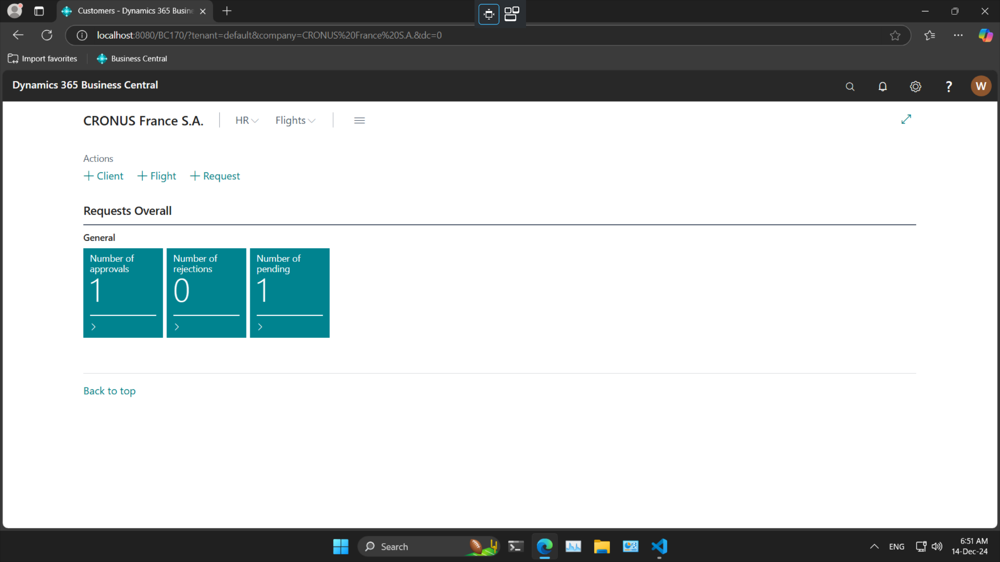
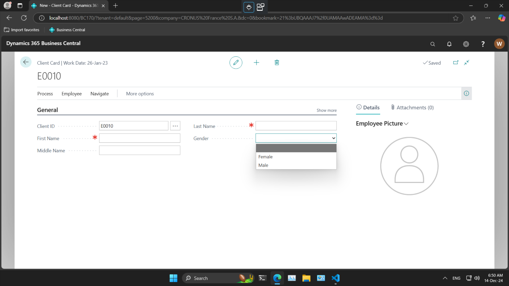
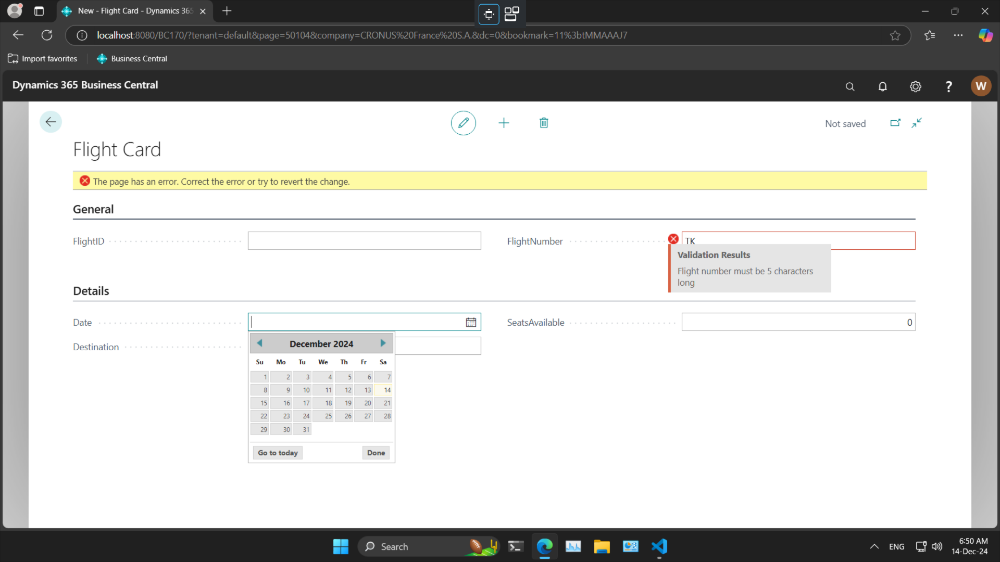
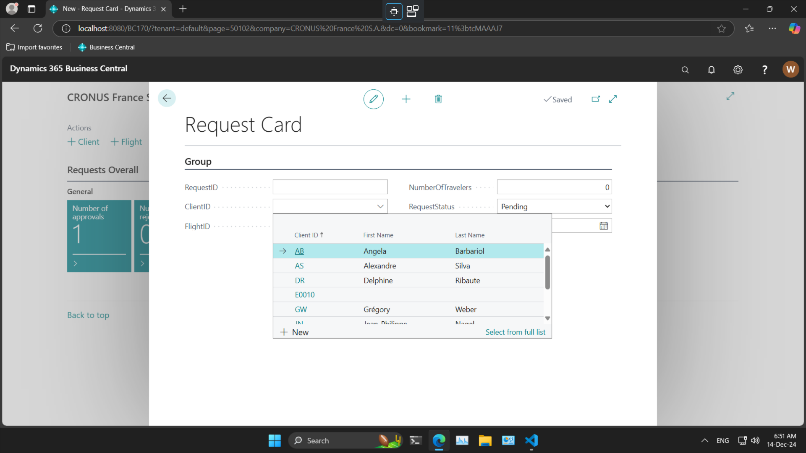
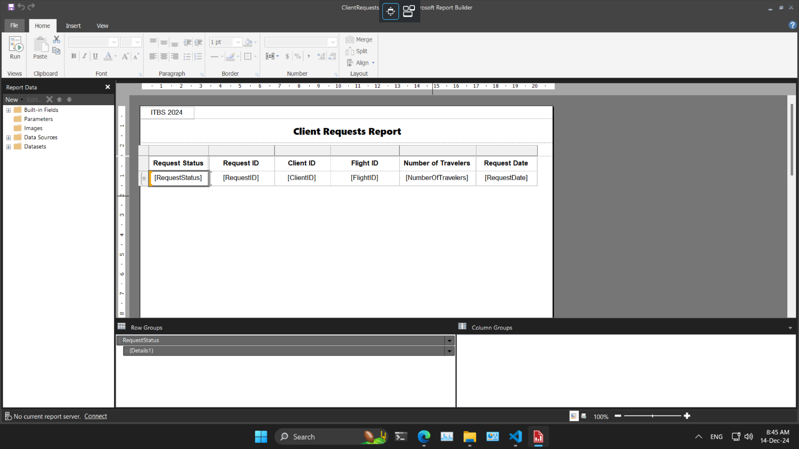
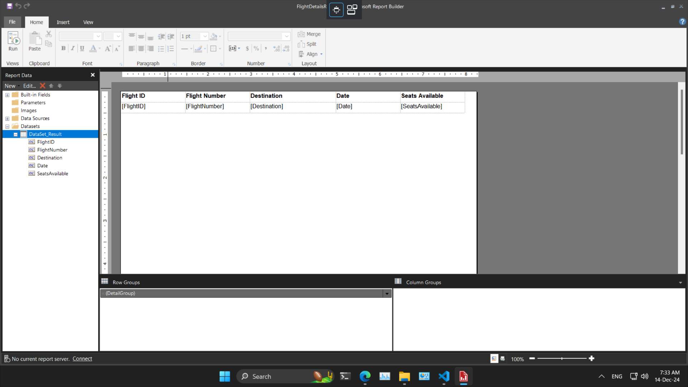

# Application Parts with Screenshots

## User Interface

The user interface is designed to be intuitive and easy to navigate.

_Screenshot: Dashboard Layout_

## Features

### Client Management

Travel agents can create and manage client profiles.

_Screenshot: Client Creation Card_

### Flight Management

Travel agents can create and manage flight details.

_Screenshot: Flight Creation Card Validation_

### Request Management

Clients can request flights, and travel agents can approve or reject these requests.

_Screenshot: Request Flight Creation Card_

### Reporting

Generate reports on clients, flights, and requests.

_Screenshot: Client Request Report Creation Design_

_Screenshot: Flight Details Report Creation Design_

## Workflow

The workflow of the application is designed to streamline operations:

1. **Login**: Users log in to access the system.
2. **Dashboard**: Users view the dashboard for an overview.
3. **Manage Clients**: Travel agents create or update client profiles.
4. **Manage Flights**: Travel agents create or update flight details.
5. **Request Flights**: Clients request flights.
6. **Approve/Reject Requests**: Travel agents approve or reject flight requests.
7. **Generate Reports**: Users generate reports for analysis.

[Back to Main](README.md)
