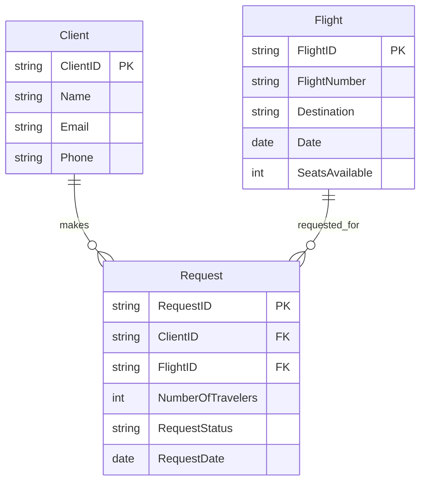
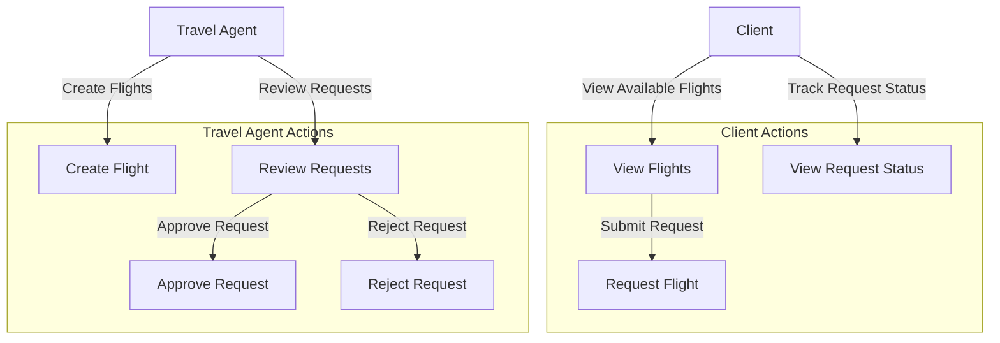
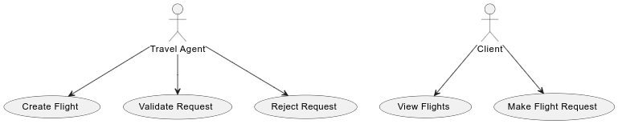

# Conception Phase

## Project Overview

The Travel ERP Business Central project aims to create an ERP system tailored for travel agencies. The system helps manage client information, flight details, and flight requests efficiently.

## Initial Ideas and Brainstorming

The initial idea was to streamline the operations of travel agencies by integrating various business processes into a single platform. Brainstorming sessions focused on identifying key pain points in current systems and how an ERP solution could address them.

## Diagrams

The following diagrams illustrate the conception phase of the project:

- ER Diagram: Entity-Relationship Diagram

- Flow Chart: General Flow Chart

- Use Case Diagram: Core Application Use Case

[Back to Main](README.md)
